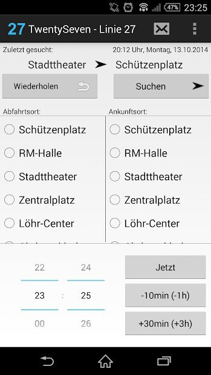
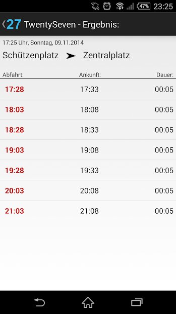
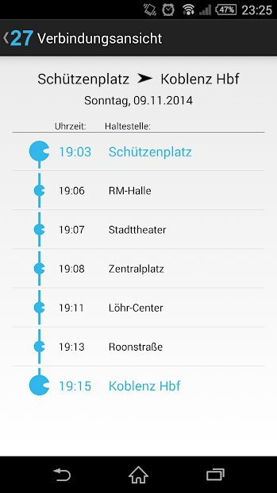

 

# Twentyseven
Twentyseven - Linie 27, eine Android-App, ist eine Fahrplanauskunft für die Koblenzer Linie 27 Asterstein - Koblenz Hauptbahnhof.

## Screenshots
  

## Credits
(C) 2012 Paul Stiegele
